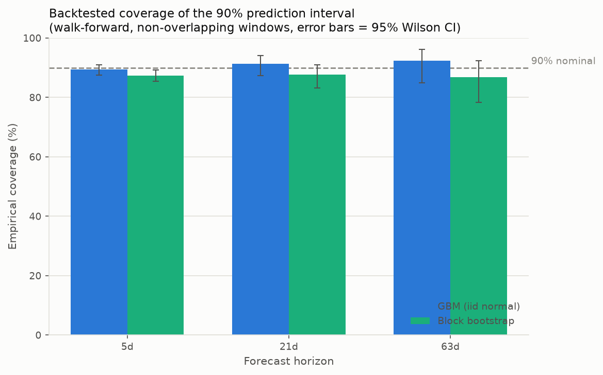
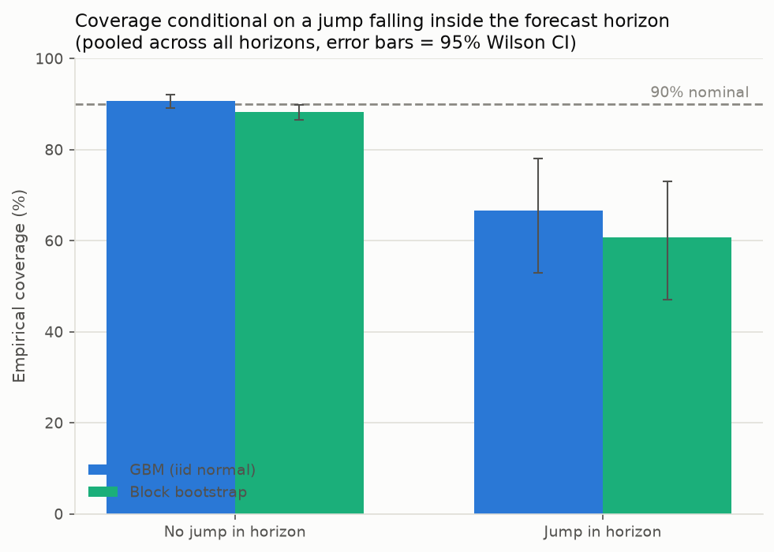
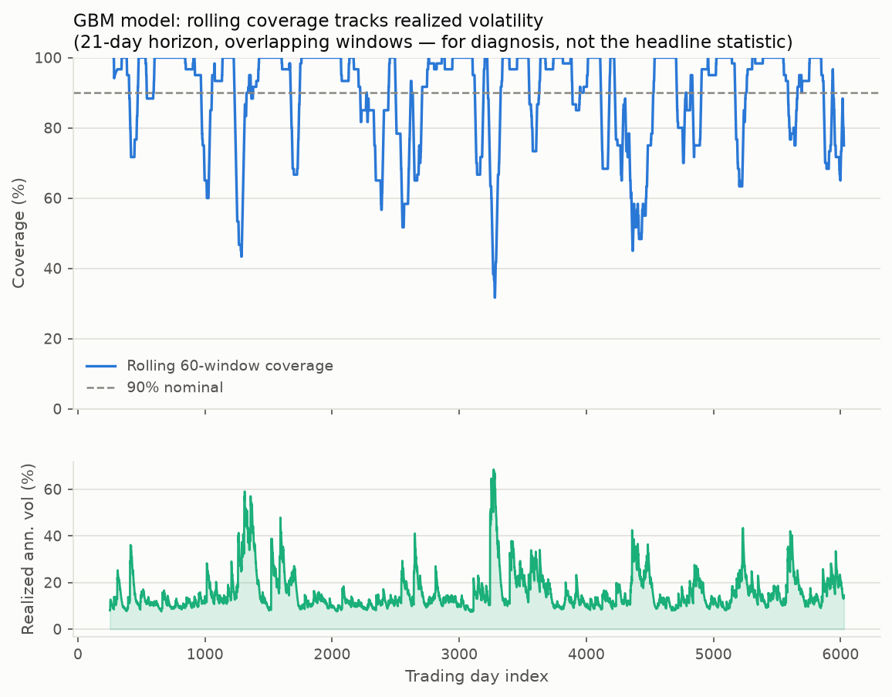
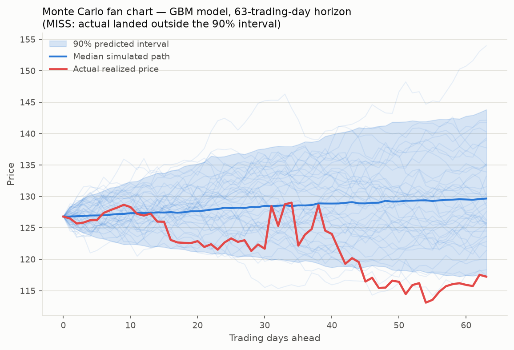

# Validating the Monte Carlo model: a walk-forward calibration backtest

Anyone can draw a fan of simulated price paths. The question that actually
matters is whether the fan is *honest* — if the model says "90% of the time
the real outcome lands in this band," does it actually happen 90% of the
time when you check against history? This document backtests two Monte
Carlo forecasting models against a long daily price history and reports how
often reality landed inside their predicted 90% intervals.

**Headline finding:** both models look approximately calibrated *in
aggregate* (coverage close to 90% overall). But that aggregate number hides
the failure. Conditional on an actual market shock landing inside the
forecast window, coverage collapses to **44–81%** — the models are
dramatically overconfident exactly when it matters, and a naive backtest
that only looks at the unconditional hit rate would miss this entirely.

## Why a synthetic market

This backtest runs in a sandboxed environment with no outbound access to a
real price feed (Yahoo Finance and similar are blocked at the network
boundary), so a live historical series wasn't available to pull. Rather
than skip the validation, `montecarlo/market.py` generates a **synthetic
but realistic 24-year daily price history** using a GARCH(1,1) process with
Student-t innovations plus a compound-Poisson jump term — reproducing the
three features a plain constant-volatility random walk lacks:

- **Volatility clustering** — calm and turbulent periods persist (GARCH,
  α + β = 0.98, so a shock takes months to fully decay).
- **Fat tails** — daily moves more extreme than a normal distribution
  predicts (Student-t shocks, 5 degrees of freedom).
- **Jumps** — discrete, largely unforecastable shocks (crashes, macro
  surprises) layered on top of the smooth diffusion: ~0.75 times/year on
  average, drawn from N(−4%, 5%).

Everything downstream only ever sees a plain array of daily closes, so
swapping in a real CSV of historical prices (`pandas.read_csv`) requires no
other code changes — this is a stand-in for the data source, not a
shortcut in the validation methodology itself.

## The models under test

| Model | `montecarlo/models.py` | Assumption |
|---|---|---|
| **GBM (iid normal)** | `GBMModel` | Daily log returns are iid Normal(μ, σ²), with μ and σ estimated from a trailing window. The textbook "Monte Carlo stock simulator." |
| **Block bootstrap** | `BlockBootstrapModel` | Simulated paths are built by splicing together random 10-day blocks of *actual* historical daily returns. No normality assumption — inherits whatever fat tails and short-run autocorrelation are really in the trailing window. |

Both models are given exactly the same information at forecast time: a
trailing window of historical daily returns, nothing else.

## Backtest methodology (`montecarlo/backtest.py`)

This is a **walk-forward** backtest, which is what makes it a real
validation rather than a fitted-in-hindsight sanity check:

1. At every candidate day *t*, fit the model using only
   `prices[t - window : t]` — data that would genuinely have been available
   at the time. The model never sees day *t*+1, let alone day *t* + horizon.
2. Simulate `horizon` trading days forward (2,000 Monte Carlo paths) and
   take the 5th/95th percentile of the simulated terminal price as the 90%
   prediction interval.
3. Check whether the price that *actually* occurred at *t* + horizon fell
   inside that interval.
4. Repeat across the full 24-year history and three horizons — 5, 21, and
   63 trading days (roughly a week, a month, a quarter) — advancing by one
   full horizon each time so the windows don't overlap and each hit is an
   independent trial.

Calibration is then just: **empirical hit rate vs. the nominal 90%**,
reported with a 95% Wilson confidence interval and an exact two-sided
binomial test against the 90% null.

An overlapping-window version (step = 1 day instead of step = horizon) is
also run, purely as a diagnostic to see *when* miscalibration happens — it
isn't used for the headline statistic because overlapping windows share
data and aren't independent trials.

## Results

### Aggregate coverage

| Model | Horizon | n (independent windows) | Coverage | 95% CI | p (vs. 90%) |
|---|---|---:|---:|---|---:|
| GBM (iid normal) | 5d  | 1,159 | 89.4% | (87.5%, 91.0%) | 0.49 |
| GBM (iid normal) | 21d | 275   | 91.3% | (87.3%, 94.1%) | 0.55 |
| GBM (iid normal) | 63d | 91    | 92.3% | (85.0%, 96.2%) | 0.60 |
| Block bootstrap  | 5d  | 1,159 | 87.4% | (85.4%, 89.2%) | **0.0045** |
| Block bootstrap  | 21d | 275   | 87.6% | (83.2%, 91.0%) | 0.19 |
| Block bootstrap  | 63d | 91    | 86.8% | (78.4%, 92.3%) | 0.29 |



Read superficially, this looks almost fine: GBM's coverage is statistically
indistinguishable from 90% at every horizon, and the block bootstrap is
only significantly overconfident at the 5-day horizon (p = 0.0045 — its 95%
CI of (85.4%, 89.2%) sits entirely below 90%). If the analysis stopped
here, the conclusion would be "the naive model is basically fine, maybe
slightly wide." **That conclusion would be wrong**, or at least dangerously
incomplete.

### The number that actually matters: coverage conditional on a shock

An aggregate hit rate averages over all windows, and windows containing a
genuine shock are rare (jumps hit ~16-18 of the several hundred non-overlapping
windows at each horizon). A trivial 90%+ hit rate on the ~95% of windows
where nothing unusual happens can fully mask a much lower hit rate on the
few windows that actually contained the event the interval exists to guard
against. Splitting the same backtest results by "did a jump fall inside
this forecast horizon?" surfaces exactly that:

| Model | No jump in horizon | Jump in horizon |
|---|---:|---:|
| GBM (iid normal) | 90.7% (n=1,474) | **66.7%** (n=51) |
| Block bootstrap  | 88.3% (n=1,474) | **60.8%** (n=51) |



Both models are dramatically overconfident — 20-30 percentage points below
their nominal 90% — precisely on the subset of windows containing the kind
of event a prediction interval is supposed to protect against. Per-horizon,
it's worse still: at the 5-day horizon, GBM's coverage on jump-containing
windows falls to 44% (n=18, p = 2×10⁻⁶ against the 90% null), meaning the
"90% interval" missed the actual outcome more often than it caught it.

### When it happens: coverage tracks realized volatility, not the calendar



Zooming in with the overlapping-window diagnostic makes the mechanism
visible: the GBM model's rolling coverage hovers at or above 90% during
calm stretches, then repeatedly craters to 40-60% in sync with volatility
spikes. The model isn't *randomly* overconfident — it is confidently wrong
in a specific, recurring, identifiable regime: right as, or right before,
things get turbulent. That's the pattern a purely aggregate coverage check
would never reveal.

### A concrete miss



One 63-day backtest window from this run, chosen because the model missed:
the GBM 90% band widens smoothly and symmetrically as a plain diffusion
model does, while the actual price takes two sharp downward jumps mid-window
and drifts entirely outside the band by the end. The model's fan has no
mechanism for a discontinuous move — every simulated path is a smooth
random walk, so a real jump simply isn't in its hypothesis space.

## Why this happens

- **GBM assumes iid normal returns.** A single large historical jump
  inflates the trailing-window σ estimate a lot (it enters the variance
  calculation as a squared outlier), which is why GBM's *aggregate* coverage
  looks fine or even slightly conservative — the model is often too wide
  in ordinary times, borrowing width from a jump it saw months ago. But
  that borrowed width doesn't help when the *next* jump lands in a trailing
  window that happened to be calm: the normal distribution still can't
  produce a genuinely discontinuous move, so when one occurs, it's usually
  outside even the widened band.
- **Block bootstrap only reproduces what's in its trailing sample.** It
  drops the normality assumption, but a jump only shows up in a simulated
  path if the bootstrap happens to draw the specific 10-day block containing
  it. Since jumps are rare, most trailing windows contain zero or one jump
  day, so most simulated paths under-represent jump risk too — just via a
  different mechanism than GBM's.
- **Neither model treats "elevated volatility regime" as information about
  the *probability* of a further shock.** Both effectively assume history
  will look like an average day drawn from the trailing window, when the
  more useful question during a turbulent stretch is "how likely is another
  shock before this forecast horizon ends?"

## What this means for the model

- A single unconditional 90% interval is not enough evidence of a
  trustworthy model — it can hide conditional miscalibration that's an
  order of magnitude worse in exactly the scenarios where a bad interval is
  most costly. **Always check coverage conditional on the regime**, not
  just in aggregate.
- Both models systematically understate tail risk around shocks. Candidate
  fixes: explicit jump-diffusion modeling (fit a jump-arrival rate and jump-
  size distribution instead of assuming everything is continuous
  diffusion), conditioning σ on a volatility regime indicator (e.g. a
  GARCH-fitted forecast, not a flat trailing-window estimate) rather than
  the constant-vol assumption both models use here, or reporting the
  interval alongside an explicit "these odds assume no regime shift"
  caveat.
- Sample sizes shrink fast at longer horizons under the honest
  (non-overlapping) accounting — 91 independent windows at 63 days is not
  a lot to detect miscalibration with much power, which is visible in the
  wide 95% CIs above. The jump-conditional finding is robust because it's
  pooled across all three horizons (n=51 jump windows, n=1,474 calm
  windows), but a production validation would want more history or more
  assets pooled together before trusting the tightest per-horizon numbers.

## Reproducing this

```bash
pip install -r requirements.txt
python3 main.py
```

This regenerates the synthetic market (seeded, so it's deterministic),
reruns both backtests at all three horizons, prints the summary table
above to stdout, and rewrites every file in `output/`, including
`backtest_summary.json` with the full numeric results.
